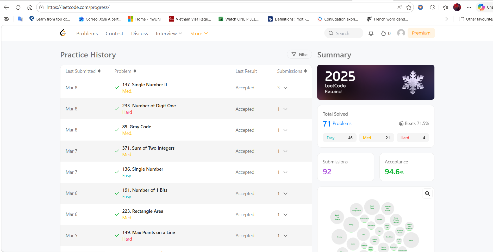

## 🏆 LeetCode Progress Evidence

This project is backed by consistent daily practice on LeetCode.  
Below is a snapshot of my progress, including total problems solved, acceptance rate, and category distribution.

> 📸 **LeetCode Progress Screenshot**  
> *(Evidence of my work and consistency)*

---

### 📊 Summary
- **Total Solved:** 71  
- **Acceptance Rate:** 94.6%  
- **Easy:** 46  
- **Medium:** 21  
- **Hard:** 4  
- **Submissions:** 92  

This visual evidence demonstrates my commitment to algorithmic problem‑solving and continuous improvement.

### 📘 dynamic_programming/
    │── climbing_stairs.ipynb
    │── coin_change.ipynb
    │── house_robber.ipynb
    └── maximum_subarray.ipynb

🔤 embeddings/
│── Find_all_anagrams_in_a_string.ipynb
│── Group_anagrams.ipynb
│── Minimum_Window_Substring.ipynb
│── Top_K_Frequent_Words.ipynb
└── longest_substring_no_repeat.ipynb

🌐 graphs/
│── Clone_graph.ipynb
│── Course_Schedule.ipynb
│── Number_of_Islands.ipynb
└── Pacific_Atlantic_Water_Flow.ipynb

📊 ranking/
│── Sort_Characters_by_Frequency.ipynb
│── Top_K_Frequent_elements.ipynb
└── kth_largest_element.ipynb

🌲 trees/
│── binary_tree_level_order_traversal.ipynb
│── invert_binary_tree.ipynb
│── path_sum.ipynb
└── symmetric_tree.ipynb

